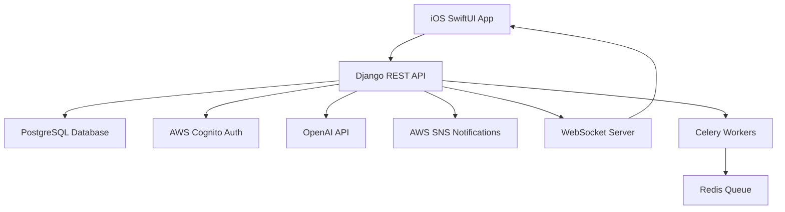

# The Phoenix Project

An ADHD-focused recovery application designed to help users manage impulsive urges through structured cognitive-behavioral tools and AI-powered personalized coaching.


[](https://opensource.org/licenses/MIT)
[](https://github.com/tiazahmd/the-phoenix)
[](https://github.com/tiazahmd/the-phoenix)

## 🎯 Project Overview

Phoenix is a comprehensive personal development platform specifically designed for individuals with ADHD who are working on recovery from impulsive behaviors. The app provides evidence-based tools, real-time support, and personalized interventions to help users build healthier habits and manage urges effectively.

### Target Audience
- **Age**: 26-35, working professionals
- **Tech Comfort**: Advanced
- **Primary Need**: Managing impulsive urges and building accountability

### Design Philosophy
- **50% Clinical & Structured**: Evidence-based interventions and structured workflows
- **15% Warm & Encouraging**: Supportive messaging and positive reinforcement
- **15% Playful & Gamified**: Achievement systems and interactive elements
- **20% Minimal & Focused**: Clean interface with reduced cognitive load

## 🏗 Architecture

### System Overview


### Technology Stack
- **Frontend**: SwiftUI 5.0 + Combine 4.0 (iOS 17.0+)
- **Backend**: Django 5.0 + Django REST Framework 3.14+
- **Database**: PostgreSQL 16
- **Authentication**: AWS Cognito + JWT
- **AI Integration**: OpenAI API (GPT-4)
- **Real-time**: Django Channels + WebSockets
- **Task Queue**: Celery + Redis
- **Notifications**: AWS SNS → APNs
- **Infrastructure**: AWS (RDS, EC2, S3, CloudFront)

## ✨ Features

### ✅ Implemented (v0.1.0-alpha)

#### Backend (Production Ready)
- **Authentication System**: JWT-based auth with user registration/login
- **Check-in System**: Daily mood/urge tracking with trigger context
- **Quiz System**: AI-generated quizzes across 11 interest domains
- **Tips System**: Personalized recovery tips with category filtering
- **Audio Exercises**: Guided audio content management with TTS
- **Urge Buster Tools**: 5 quick intervention tools
- **Dashboard Analytics**: Progress tracking and streak metrics
- **Scenario Simulations**: AI-driven branching scenarios
- **Weekly Reflections**: AI-generated summaries and insights
- **API Documentation**: Comprehensive Swagger/OpenAPI docs
- **WebSocket Support**: Real-time notifications and updates
- **Security Features**: Rate limiting, CORS, security headers

#### iOS Frontend (SPEC Compliant)
- **Check-In System**: Primary entry point with mood/urge sliders (1-10)
- **Daily Quiz Feature**: AI-generated MCQs across 11 interest domains
- **Urge Buster Tools**: 5 intervention tools (puzzles, timers, prompts, safety checks, memory flashbacks)
- **Tips Feed**: Personalized recovery tips with infinite scroll and filtering
- **Dashboard**: Recovery-focused progress tracking with streaks
- **Audio Exercises**: Guided audio content with multiple themes
- **Navigation**: 5-tab structure optimized for recovery workflows

### 🚧 In Development
- Authentication integration (AWS Cognito + Biometric unlock)
- Core Data implementation for offline functionality
- Network layer with robust error handling
- Real-time WebSocket integration

### 📋 Planned Features
- Scenario simulations UI
- Weekly reflections with charts
- Push notifications (AWS SNS)
- Advanced analytics (Firebase + Sentry)
- End-to-end encryption
- TestFlight beta distribution

## 🚀 Getting Started

### Prerequisites
- **macOS**: Sonoma 14.0+ (for iOS development)
- **Xcode**: 15.0+
- **Python**: 3.12+
- **Node.js**: 20.x (for tooling)
- **PostgreSQL**: 16+
- **Git**: Latest version

### Quick Start

1. **Clone the repository**:
   ```bash
   git clone https://github.com/tiazahmd/the-phoenix.git
   cd the-phoenix
   ```

2. **Backend Setup**:
   ```bash
   cd backend
   python -m venv venv
   source venv/bin/activate  # On Windows: venv\Scripts\activate
   pip install -r requirements.txt
   
   # Database setup
   createdb phoenix_dev
   python manage.py migrate
   python manage.py runserver
   ```

3. **iOS Setup**:
   ```bash
   cd ios
   brew install xcodegen swiftlint
   xcodegen generate
   open Phoenix.xcodeproj
   ```

4. **Access the application**:
   - **Backend API**: http://localhost:8000
   - **API Documentation**: http://localhost:8000/swagger/
   - **Admin Interface**: http://localhost:8000/admin/
   - **iOS App**: Build and run in Xcode

## 📁 Project Structure

```
the-phoenix/
├── backend/                    # Django REST API
│   ├── apps/                   # Feature-based Django apps
│   │   ├── authentication/     # User auth and profiles
│   │   ├── checkins/          # Daily check-ins and mood tracking
│   │   ├── dashboard/         # Analytics and progress tracking
│   │   ├── exercises/         # Audio exercises and content
│   │   ├── quizzes/           # AI-generated quiz system
│   │   ├── reflections/       # Weekly reflection summaries
│   │   ├── simulations/       # Scenario simulation engine
│   │   └── tips/              # Personalized tips system
│   ├── config/                # Django configuration
│   │   ├── settings/          # Environment-specific settings
│   │   ├── urls.py           # URL routing
│   │   └── wsgi.py           # WSGI configuration
│   └── core/                  # Shared functionality
│       ├── models.py         # Base models
│       └── websockets/       # Real-time communication
├── ios/                       # SwiftUI iOS Application
│   ├── Phoenix/
│   │   ├── Sources/
│   │   │   ├── App/          # App entry point
│   │   │   │   ├── Features/     # Feature-based modules
│   │   │   │   │   ├── CheckIn/  # Mood/urge tracking
│   │   │   │   │   ├── Quiz/     # Daily quiz system
│   │   │   │   │   ├── UrgeBuster/ # Intervention tools
│   │   │   │   │   ├── Tips/     # Tips feed
│   │   │   │   │   ├── Dashboard/ # Progress tracking
│   │   │   │   │   └── Audio/    # Guided exercises
│   │   │   │   ├── Core/         # Core functionality (planned)
│   │   │   │   ├── UI/           # Reusable components (planned)
│   │   │   │   └── Utils/        # Utility functions (planned)
│   │   │   ├── Tests/            # Unit and UI tests (planned)
│   │   │   └── Configuration/    # Project configuration
│   │   ├── Tests/            # Unit and UI tests (planned)
│   │   └── Configuration/    # Project configuration
│   ├── project.yml           # XcodeGen configuration
│   └── .swiftlint.yml       # SwiftLint rules
├── docs/                     # Project documentation
├── tests/                    # Integration tests (planned)
└── .github/                  # GitHub Actions and templates
```

## 🛠 Development

### Backend Development

1. **Start the development server**:
   ```bash
   cd backend
   source venv/bin/activate
   python manage.py runserver
   ```

2. **Run tests**:
   ```bash
   python manage.py test
   # or with pytest
   pytest
   ```

3. **Create migrations**:
   ```bash
   python manage.py makemigrations
   python manage.py migrate
   ```

4. **Access admin interface**:
   ```bash
   python manage.py createsuperuser
   # Visit http://localhost:8000/admin/
   ```

### iOS Development

1. **Generate Xcode project**:
   ```bash
   cd ios
   xcodegen generate
   ```

2. **Run SwiftLint**:
   ```bash
   swiftlint
   swiftlint --fix  # Auto-fix issues
   ```

3. **Build and run**:
   - Open `Phoenix.xcodeproj` in Xcode
   - Select simulator or device
   - Press `Cmd + R` to build and run

### Code Quality

#### Backend
- **Django best practices**: Follow Django coding standards
- **pytest**: Comprehensive test suite
- **Black**: Code formatting
- **isort**: Import sorting
- **flake8**: Linting

#### iOS
- **SwiftLint**: Enforced code style with custom rules
- **MVVM Architecture**: Clean separation of concerns
- **Feature-based organization**: Self-contained modules
- **iOS 17 Guidelines**: Following Apple's Human Interface Guidelines

## 🧪 Testing

### Current Status
- **Backend**: Comprehensive test suite with pytest
- **iOS**: Not implemented (planned for >90% coverage)
- **Integration**: Not implemented (planned)
- **E2E**: Not implemented (planned)

### Testing Strategy
```bash
# Backend tests
cd backend
pytest --cov=apps --cov-report=html

# iOS tests (planned)
cd ios
xcodebuild test -scheme Phoenix -destination 'platform=iOS Simulator,name=iPhone 15'
```

## 🔄 CI/CD Pipeline

Our GitHub Actions pipeline ensures code quality and automated deployments:

### Continuous Integration
- **Trigger**: Every push and pull request
- **Backend Pipeline**:
  1. Python 3.12 matrix testing
  2. Django test suite execution
  3. Code coverage reporting (target: >85%)
  4. Security scanning with Bandit
  5. Code quality checks (Black, isort, flake8)
- **iOS Pipeline**:
  1. Xcode build verification
  2. SwiftLint code style enforcement
  3. Unit test execution (when implemented)
  4. Archive and export for TestFlight

### Continuous Deployment
- **Trigger**: Version tags (v*)
- **Environments**:
  - **Development**: Automatic deployment on main branch
  - **Staging**: Automatic deployment on release branches
  - **Production**: Manual approval required
- **Process**:
  1. Build and test all components
  2. Security and vulnerability scanning
  3. Generate release notes
  4. Deploy backend to AWS
  5. Distribute iOS build via TestFlight
  6. Update documentation

### Release Process
```bash
# Create a new version
git tag v1.0.0
git push origin v1.0.0

# This triggers:
# 1. Automated testing
# 2. Security scanning
# 3. Build generation
# 4. Release creation
# 5. Deployment (with approval)
```

### Quality Gates
- **Code Coverage**: Minimum 85% for backend
- **Security Scan**: No high/critical vulnerabilities
- **Performance**: Backend response time <200ms
- **iOS Build**: Successful archive and validation

## 🚀 Deployment

### Development Environment
- **Local development**: Django dev server + Xcode simulator
- **Database**: Local PostgreSQL instance
- **API testing**: Swagger UI at `/swagger/`

### Staging Environment (Planned)
- **Backend**: AWS EC2 with Docker
- **Database**: AWS RDS PostgreSQL
- **iOS**: TestFlight beta distribution
- **Monitoring**: CloudWatch + Sentry

### Production Environment (Planned)
- **Backend**: AWS ECS with auto-scaling
- **Database**: AWS RDS with read replicas
- **CDN**: CloudFront for static assets
- **iOS**: App Store distribution
- **Monitoring**: Full observability stack

## 📊 Current Status

### Completed ✅
- Django backend with all core features
- iOS UI restructuring to match SPEC requirements
- ADHD recovery-focused feature set
- API documentation and testing
- Project architecture and organization

### In Progress 🔄
- iOS authentication integration
- Core Data implementation
- Network layer development
- Real-time features

### Planned 📋
- Advanced analytics and insights
- Push notification system
- Performance optimization
- App Store submission

## 🔒 Security

### Implemented
- **Backend**: Rate limiting, CORS, CSRF protection, secure headers
- **Authentication**: JWT tokens with refresh mechanism
- **Data Validation**: Comprehensive input validation
- **Environment**: Secure credential management

### Planned
- **iOS**: Biometric authentication, keychain storage
- **Encryption**: End-to-end encryption for sensitive data
- **Compliance**: GDPR compliance measures
- **Monitoring**: Security event logging

## 📚 Documentation

- **[SPEC.md](SPEC.md)**: Complete project specification
- **[PROJECT_UPDATE.md](PROJECT_UPDATE.md)**: Development history and current status
- **[CHANGELOG.md](ios/CHANGELOG.md)**: Version history and changes
- **[iOS README](ios/README.md)**: iOS-specific setup and development
- **API Documentation**: Available at `/swagger/` when backend is running

## 🤝 Contributing

### Development Workflow
1. Fork the repository
2. Create a feature branch: `git checkout -b feature/amazing-feature`
3. Make your changes following the coding standards
4. Run tests and ensure they pass
5. Commit using conventional commits: `git commit -m "feat: add amazing feature"`
6. Push to your fork: `git push origin feature/amazing-feature`
7. Create a Pull Request

### Commit Convention
- `feat:` New features
- `fix:` Bug fixes
- `docs:` Documentation updates
- `style:` Code style changes
- `refactor:` Code refactoring
- `test:` Test additions/updates
- `chore:` Build process and tool updates

### Code Review Process
- All changes require pull request review
- Automated checks must pass (linting, tests)
- Manual testing on both platforms
- Documentation updates for new features

## 🐛 Known Issues

### Current Limitations
- **No authentication**: iOS app accessible without login
- **No data persistence**: iOS data lost on app restart
- **Mock API integration**: All backend calls simulated in iOS
- **No offline support**: Requires internet connection
- **No push notifications**: Reminder system not implemented

### Performance Issues
- **Memory management**: Timer cleanup in UrgeBuster tools
- **State management**: Some inefficient state updates in iOS
- **Network handling**: No retry logic or offline queue

## 📞 Support

### Getting Help
- **GitHub Issues**: [Create an issue](https://github.com/tiazahmd/the-phoenix/issues)
- **Documentation**: Check SPEC.md for detailed requirements
- **Project Updates**: See PROJECT_UPDATE.md for current status

### Development Questions
- Review the comprehensive documentation
- Check existing issues and discussions
- Follow the contributing guidelines

## 📄 License

This project is licensed under the MIT License - see the [LICENSE](LICENSE) file for details.

### MIT License Summary
- ✅ **Commercial use**: Permitted
- ✅ **Modification**: Permitted  
- ✅ **Distribution**: Permitted
- ✅ **Private use**: Permitted
- ❌ **Liability**: Limited
- ❌ **Warranty**: None

### Third-Party Licenses
- **Django**: BSD License
- **SwiftUI**: Apple Developer License
- **OpenAI API**: OpenAI Terms of Service
- **AWS Services**: AWS Customer Agreement

## 👥 Team

**Lead Developer**: Tiaz Ahmed ([@tiazahmd](https://github.com/tiazahmd))

### Acknowledgments
- Django and Django REST Framework communities
- Apple's SwiftUI and iOS development resources
- OpenAI for AI integration capabilities
- AWS for cloud infrastructure services

---

**Current Version**: v0.1.0-alpha  
**Last Updated**: January 2024  
**Status**: iOS restructuring complete, ready for backend integration

For the most up-to-date information, see [PROJECT_UPDATE.md](PROJECT_UPDATE.md). 