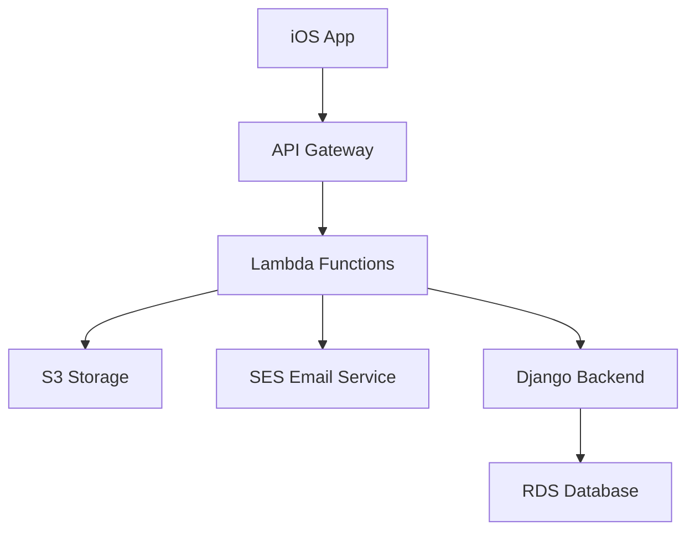

# The Phoenix Project

A modern, serverless application built with AWS Lambda, iOS, and Django, demonstrating best practices in cloud-native development.


[](https://opensource.org/licenses/MIT)

## Overview

The Phoenix Project is a scalable, cloud-native application that showcases modern development practices and architecture. It combines serverless computing, mobile development, and a robust backend to deliver a seamless user experience.

## Architecture

### System Components


### Key Features
- **Serverless Processing**: AWS Lambda functions for efficient, scalable operations
- **Real-time Notifications**: Event-driven architecture using AWS SES
- **Secure File Handling**: S3-based storage with proper access controls
- **RESTful API**: Django-powered backend with comprehensive API documentation
- **Modern UI**: SwiftUI-based iOS application following Apple's HIG

## Project Structure

```
.
├── lambda/                  # AWS Lambda Functions
│   ├── image-processor/     # Image processing function
│   │   ├── src/            # Source code
│   │   ├── __tests__/      # Unit tests
│   │   └── package.json    # Dependencies
│   └── notification-handler/# Notification handling function
│       ├── src/            # Source code
│       ├── __tests__/      # Unit tests
│       └── package.json    # Dependencies
├── ios/                    # iOS SwiftUI Application
├── backend/                # Django Backend
├── tests/                  # Integration Tests
├── docs/                   # Documentation
└── .github/               # GitHub Actions and Templates
```

## Lambda Functions

### Image Processor
Handles image processing using the Sharp library:
- **Input**: Images via S3 or direct upload
- **Processing**:
  - Resizing (maintaining aspect ratio)
  - Format conversion (JPEG, PNG, WebP)
  - Optimization (quality vs size)
  - Metadata handling (EXIF)
- **Output**: Processed images to S3

### Notification Handler
Manages notifications using AWS SES:
- **Features**:
  - Templated email notifications
  - System alerts and monitoring
  - User communications
  - Delivery tracking
- **Integration**: Works with SNS for real-time delivery

## Development Setup

### Prerequisites
- Node.js 20.x
- Python 3.12
- AWS CLI configured with appropriate permissions
- Xcode 15.0+ (for iOS development)
- Git
- npm/yarn

### Environment Setup

1. **Clone and Configure**:
   ```bash
   git clone https://github.com/tiazahmd/the-phoenix.git
   cd the-phoenix
   ```

2. **Install Dependencies**:
   ```bash
   # Root dependencies
   npm install

   # Lambda function dependencies
   cd lambda/image-processor && npm install && cd ../..
   cd lambda/notification-handler && npm install && cd ../..
   ```

3. **AWS Configuration**:
   ```bash
   aws configure
   # Set up your AWS credentials and region
   ```

4. **Environment Variables**:
   ```bash
   # Copy example env files
   cp .env.example .env
   ```

### Development Workflow

#### Local Development
1. **Lambda Functions**:
   ```bash
   # Start local development
   cd lambda/[function-name]
   npm run dev

   # Run tests
   npm test

   # Check code style
   npm run lint
   ```

2. **Testing**:
   ```bash
   # Run all tests
   npm test

   # Run specific test suite
   npm test -- --testPathPattern=image-processor
   ```

3. **Code Quality**:
   ```bash
   # Lint code
   npm run lint

   # Fix auto-fixable issues
   npm run lint -- --fix
   ```

## CI/CD Pipeline

Our GitHub Actions pipeline ensures code quality and automated deployments:

### Continuous Integration
- **Trigger**: Every push and pull request
- **Steps**:
  1. Unit Tests (Matrix testing on Node.js 20.x)
  2. Code Linting (ESLint)
  3. Security Scanning (Snyk)

### Continuous Deployment
- **Trigger**: Version tags (v*)
- **Environments**:
  - Development (automatic)
  - Production (manual approval)
- **Process**:
  1. Build and test
  2. Security scan
  3. Generate release notes
  4. Create GitHub release
  5. Deploy to AWS

### Release Process
```bash
# Create a new version
git tag v1.0.0
git push origin v1.0.0
```

## Code Quality Standards

### Linting Rules
- ESLint with Airbnb configuration
- Prettier for code formatting
- Husky for pre-commit hooks

### Testing Requirements
- Unit test coverage > 80%
- Integration tests for critical paths
- E2E tests for user workflows

## Security Measures

### Code Security
- Regular dependency updates
- Automated vulnerability scanning
- Secure coding practices enforcement

### AWS Security
- Least privilege access
- Encrypted data at rest
- Secure API endpoints

### CI/CD Security
- Protected secrets in GitHub Actions
- Secure deployment process
- Manual approval for production

## Monitoring and Logging

### AWS CloudWatch
- Lambda function logs
- Performance metrics
- Error tracking

### Application Monitoring
- Request/Response logging
- Error reporting
- Performance tracking

## Contributing

1. **Fork and Clone**:
   ```bash
   git clone https://github.com/your-username/the-phoenix.git
   ```

2. **Create Feature Branch**:
   ```bash
   git checkout -b feature/amazing-feature
   ```

3. **Commit Changes**:
   ```bash
   git commit -m "feat: add amazing feature"
   ```

4. **Push and Create PR**:
   ```bash
   git push origin feature/amazing-feature
   # Create PR through GitHub UI
   ```

### Commit Message Format
We follow conventional commits:
- `feat:` New features
- `fix:` Bug fixes
- `docs:` Documentation
- `chore:` Maintenance
- `test:` Testing changes

## Troubleshooting

### Common Issues
1. **Lambda Deployment Failures**
   - Check IAM permissions
   - Verify environment variables
   - Review CloudWatch logs

2. **CI Pipeline Issues**
   - Ensure tests pass locally
   - Check GitHub Actions logs
   - Verify secret configuration

## License

This project is licensed under the MIT License - see the [LICENSE](LICENSE) file for details.

## Contact

Imtiaz Ahmed
- GitHub: [@tiazahmd](https://github.com/tiazahmd)
- Email: [Your Email]

## Acknowledgments

- AWS Lambda team for excellent documentation
- The Sharp image processing library
- Django REST framework team 